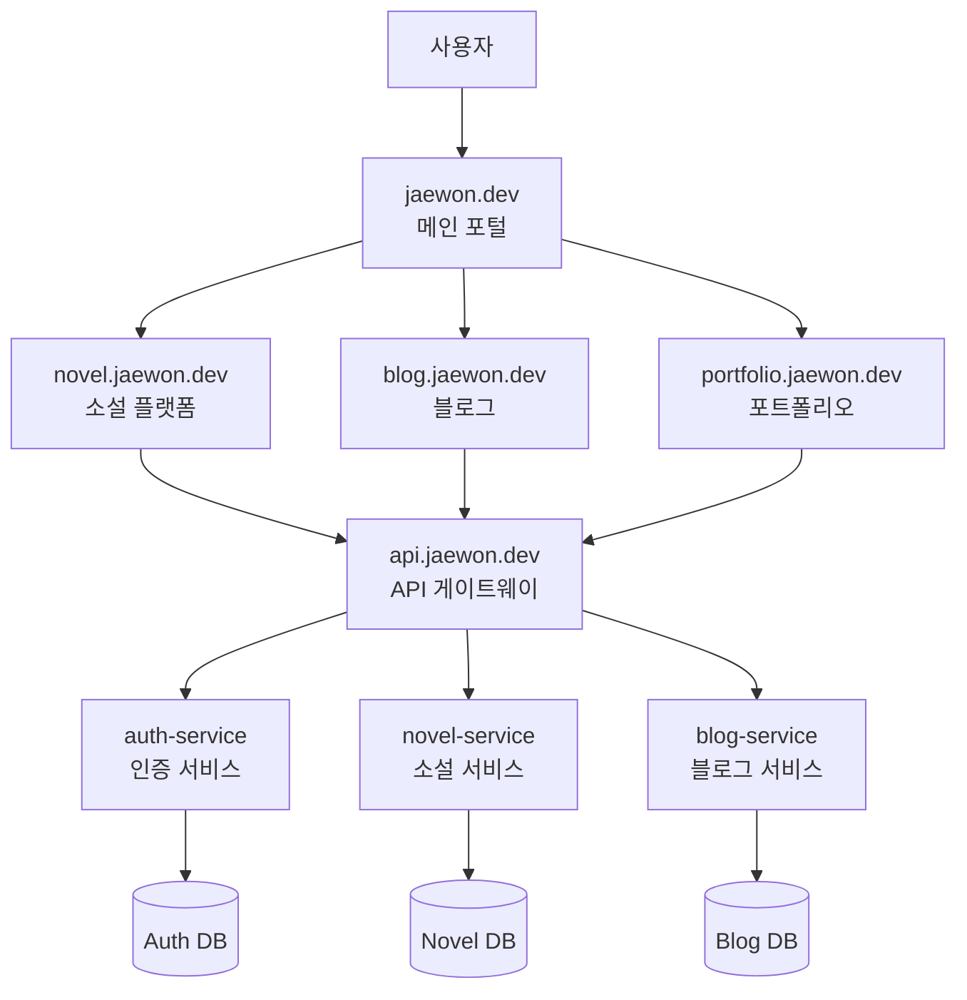
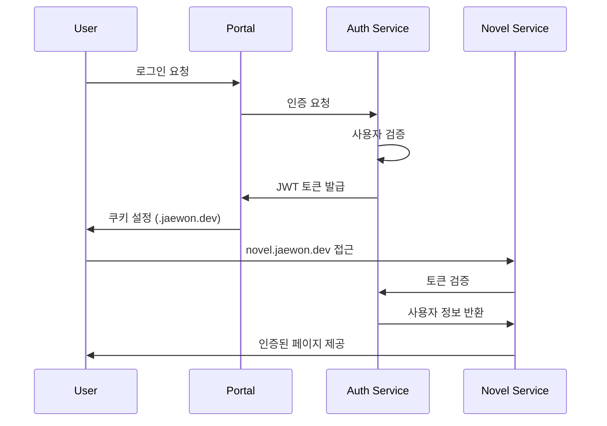

# 통합 포털 아키텍처 설계서

## 1. 프로젝트 개요

개인 프로젝트들을 하나의 통합된 생태계로 관리하기 위한 포털 아키텍처입니다. 모든 프로젝트가 공통 인증을 사용하고, 하나의 메인 도메인 하위에서 서브도메인으로 분리되어 운영됩니다.

### 목표
- 공통 인증 시스템으로 SSO 구현
- 프로젝트별 독립적 개발 및 배포
- 통합된 사용자 경험 제공
- 확장 가능한 마이크로서비스 아키텍처

---

## 2. 도메인 구조

```
jaewon.dev (메인 포털)
├── novel.jaewon.dev      # 소설 플랫폼 서비스
├── blog.jaewon.dev       # 개인 블로그 (향후)
├── portfolio.jaewon.dev  # 포트폴리오 사이트 (향후)
├── api.jaewon.dev        # API 게이트웨이
└── auth.jaewon.dev       # 인증 서비스
```

---

## 3. 시스템 아키텍처

### 3.1 전체 구조도



### 3.2 마이크로서비스 구조

```
jaewon-ecosystem/
├── services/
│   ├── auth-service/         # 공통 인증 서비스
│   │   ├── src/main/java/com/jaewon/auth/
│   │   ├── build.gradle
│   │   └── Dockerfile
│   ├── novel-service/        # 소설 플랫폼 서비스
│   │   ├── src/main/java/com/jaewon/novel/
│   │   ├── build.gradle
│   │   └── Dockerfile
│   └── gateway-service/      # API 게이트웨이
│       ├── src/main/java/com/jaewon/gateway/
│       ├── build.gradle
│       └── Dockerfile
├── frontend/
│   ├── main-portal/          # Next.js 메인 포털
│   │   ├── pages/
│   │   ├── components/
│   │   └── package.json
│   └── novel-frontend/       # 소설 플랫폼 프론트엔드
│       ├── pages/
│       ├── components/
│       └── package.json
├── shared/
│   ├── common-entities/      # 공통 엔티티 (User, 등)
│   └── common-utils/         # 공통 유틸리티
├── infrastructure/
│   ├── docker-compose.yml    # 로컬 개발 환경
│   ├── k8s/                  # Kubernetes 배포 설정
│   └── terraform/            # AWS 인프라 설정
└── docs/
    ├── api-specs/            # API 명세서들
    └── architecture/         # 아키텍처 문서들
```

---

## 4. 서비스별 상세 설계

### 4.1 인증 서비스 (auth-service)

#### 기능
- 사용자 회원가입/로그인
- JWT 토큰 발급/검증
- OAuth 연동 (Google, GitHub, Kakao)
- 사용자 프로필 관리
- 권한 관리

#### API 엔드포인트
```
POST /auth/register          # 회원가입
POST /auth/login            # 로그인
POST /auth/logout           # 로그아웃
POST /auth/refresh          # 토큰 갱신
GET  /auth/profile          # 프로필 조회
PUT  /auth/profile          # 프로필 수정
POST /auth/oauth/{provider} # OAuth 로그인
GET  /auth/verify           # 토큰 검증 (내부 API)
```

#### 데이터베이스 스키마
```sql
-- 사용자 기본 정보
CREATE TABLE users (
    id BIGINT PRIMARY KEY AUTO_INCREMENT,
    username VARCHAR(50) UNIQUE NOT NULL,
    email VARCHAR(100) UNIQUE NOT NULL,
    password_hash VARCHAR(255),
    status ENUM('ACTIVE', 'INACTIVE', 'SUSPENDED'),
    created_at TIMESTAMP DEFAULT CURRENT_TIMESTAMP,
    updated_at TIMESTAMP DEFAULT CURRENT_TIMESTAMP ON UPDATE CURRENT_TIMESTAMP
);

-- 사용자 프로필
CREATE TABLE user_profiles (
    id BIGINT PRIMARY KEY AUTO_INCREMENT,
    user_id BIGINT NOT NULL,
    display_name VARCHAR(100),
    avatar_url VARCHAR(500),
    bio TEXT,
    website VARCHAR(200),
    location VARCHAR(100),
    FOREIGN KEY (user_id) REFERENCES users(id)
);

-- OAuth 연동 정보
CREATE TABLE oauth_accounts (
    id BIGINT PRIMARY KEY AUTO_INCREMENT,
    user_id BIGINT NOT NULL,
    provider VARCHAR(20) NOT NULL,
    provider_user_id VARCHAR(100) NOT NULL,
    email VARCHAR(100),
    created_at TIMESTAMP DEFAULT CURRENT_TIMESTAMP,
    FOREIGN KEY (user_id) REFERENCES users(id),
    UNIQUE KEY unique_provider_user (provider, provider_user_id)
);
```

### 4.2 소설 서비스 (novel-service)

#### 기능
- 소설 작품 관리
- 챕터 관리
- 랭킹 시스템
- 플랫폼 연동
- 검색 기능

#### API 엔드포인트
```
GET  /novels                # 소설 목록 조회
GET  /novels/{id}          # 소설 상세 조회
POST /novels               # 소설 등록
PUT  /novels/{id}          # 소설 수정
DELETE /novels/{id}        # 소설 삭제

GET  /novels/{id}/chapters # 챕터 목록
POST /novels/{id}/chapters # 챕터 등록
PUT  /chapters/{id}        # 챕터 수정
DELETE /chapters/{id}      # 챕터 삭제

GET  /rankings             # 랭킹 조회
GET  /search               # 검색
```

### 4.3 API 게이트웨이 (gateway-service)

#### 기능
- 라우팅 및 로드 밸런싱
- 인증/인가 미들웨어
- 요청/응답 로깅
- Rate Limiting
- CORS 처리

#### 라우팅 규칙
```
/auth/*     → auth-service
/novels/*   → novel-service
/blog/*     → blog-service (향후)
/admin/*    → admin-service (향후)
```

---

## 5. 프론트엔드 구조

### 5.1 메인 포털 (main-portal)

#### 기능
- 프로젝트 소개 및 네비게이션
- 통합 로그인 페이지
- 개인 대시보드
- 프로젝트별 바로가기

#### 페이지 구조
```
pages/
├── index.tsx              # 메인 랜딩 페이지
├── login.tsx             # 로그인 페이지
├── dashboard.tsx         # 개인 대시보드
├── projects/
│   ├── index.tsx         # 프로젝트 목록
│   └── [slug].tsx        # 프로젝트 상세
└── profile/
    ├── index.tsx         # 프로필 조회
    └── edit.tsx          # 프로필 편집
```

### 5.2 소설 플랫폼 (novel-frontend)

#### 기능
- 소설 랭킹 및 목록
- 소설 상세 페이지
- 작가 연재 도구
- 검색 및 필터링

---

## 6. 배포 및 인프라

### 6.1 AWS 인프라 구조

```
Route 53 (DNS)
├── jaewon.dev → CloudFront → S3 (정적 사이트)
├── novel.jaewon.dev → CloudFront → S3 (정적 사이트)
├── api.jaewon.dev → ALB → ECS (API 서비스들)
└── auth.jaewon.dev → ALB → ECS (인증 서비스)
```

### 6.2 ECS 서비스 구성

```
ECS Cluster: jaewon-ecosystem
├── auth-service (ECS Service)
├── novel-service (ECS Service)
├── gateway-service (ECS Service)
└── blog-service (ECS Service, 향후)
```

### 6.3 데이터베이스

```
RDS MySQL (Multi-AZ)
├── auth_db       # 인증 서비스 DB
├── novel_db      # 소설 서비스 DB
└── blog_db       # 블로그 서비스 DB (향후)

ElastiCache Redis
├── session-store # 세션 저장소
└── cache-store   # 캐시 저장소
```

---

## 7. SSO(Single Sign-On) 구현

### 7.1 토큰 공유 메커니즘

#### JWT 토큰 저장
- **쿠키 기반**: `httpOnly`, `secure`, `sameSite=None`
- **도메인 설정**: `.jaewon.dev` (모든 서브도메인에서 접근 가능)
- **토큰 타입**: Access Token (1시간), Refresh Token (30일)

#### 인증 플로우


### 7.2 보안 고려사항

- **HTTPS 강제**: 모든 도메인에서 SSL/TLS 적용
- **CSRF 보호**: SameSite 쿠키 설정
- **XSS 보호**: Content Security Policy 적용
- **토큰 만료**: 적절한 토큰 만료 시간 설정

---

## 8. 개발 및 배포 전략

### 8.1 단계별 구현 계획

#### Phase 1: 기반 구조 (1-2개월)
1. 현재 novel-prizes-backend에서 인증 부분 분리
2. auth-service 독립 서비스로 구축
3. 메인 포털 기본 구조 개발
4. Docker 컨테이너화

#### Phase 2: 통합 및 배포 (1개월)
1. API 게이트웨이 구축
2. SSO 구현 및 테스트
3. AWS 인프라 구축
4. CI/CD 파이프라인 구축

#### Phase 3: 확장 (지속적)
1. 블로그 서비스 추가
2. 포트폴리오 사이트 추가
3. 관리자 도구 개발
4. 모니터링 및 로깅 강화

### 8.2 개발 환경

#### 로컬 개발
```bash
# Docker Compose로 전체 서비스 실행
docker-compose up -d

# 개별 서비스 개발
cd services/auth-service && ./gradlew bootRun
cd services/novel-service && ./gradlew bootRun
cd frontend/main-portal && npm run dev
```

#### 환경 분리
- **개발**: `dev.jaewon.dev`
- **스테이징**: `staging.jaewon.dev`
- **운영**: `jaewon.dev`

---

## 9. 모니터링 및 운영

### 9.1 로깅
- **중앙집중식 로깅**: ELK Stack (Elasticsearch, Logstash, Kibana)
- **분산 추적**: AWS X-Ray 또는 Jaeger
- **메트릭 수집**: Prometheus + Grafana

### 9.2 알림
- **장애 알림**: Slack, Email
- **성능 모니터링**: CloudWatch
- **에러 추적**: Sentry

---

## 10. 비용 최적화

### 10.1 AWS 리소스 최적화
- **ECS Fargate**: 서버리스 컨테이너로 관리 부담 감소
- **CloudFront**: 정적 자원 캐싱으로 비용 절약
- **RDS 스팟 인스턴스**: 개발/테스트 환경에서 비용 절약
- **Auto Scaling**: 트래픽에 따른 자동 확장/축소

### 10.2 개발 비용
- **공통 컴포넌트**: 재사용 가능한 컴포넌트 라이브러리 구축
- **자동화**: CI/CD로 배포 자동화
- **모니터링**: 조기 문제 발견으로 유지보수 비용 절약

---

이 문서는 통합 포털 아키텍처의 전체적인 설계를 담고 있으며, 실제 구현 과정에서 필요에 따라 수정될 수 있습니다.