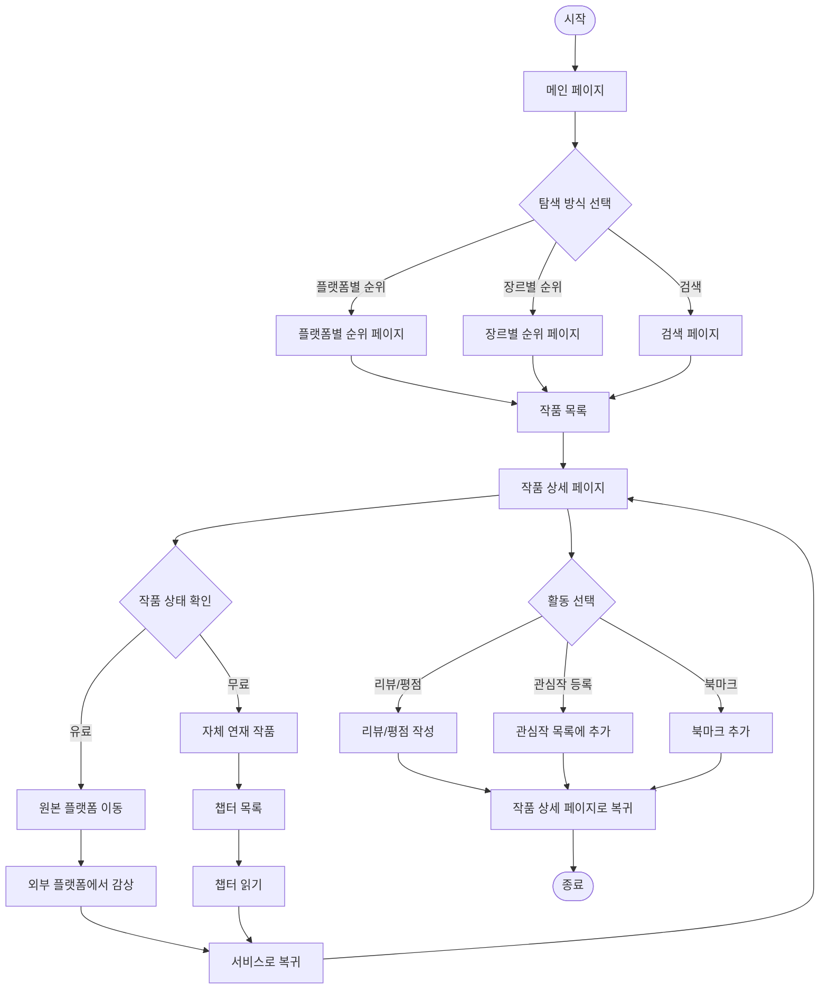
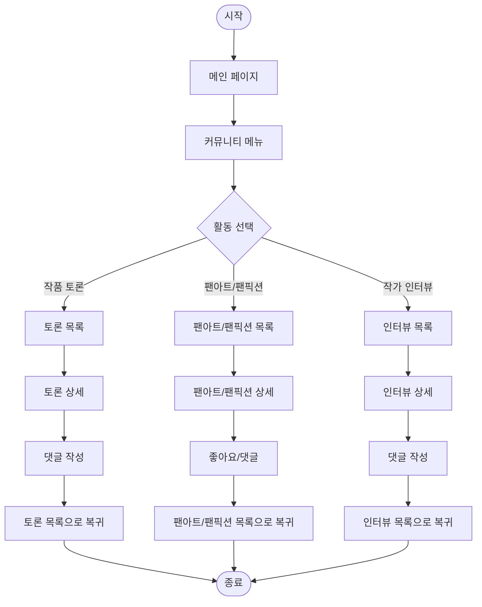
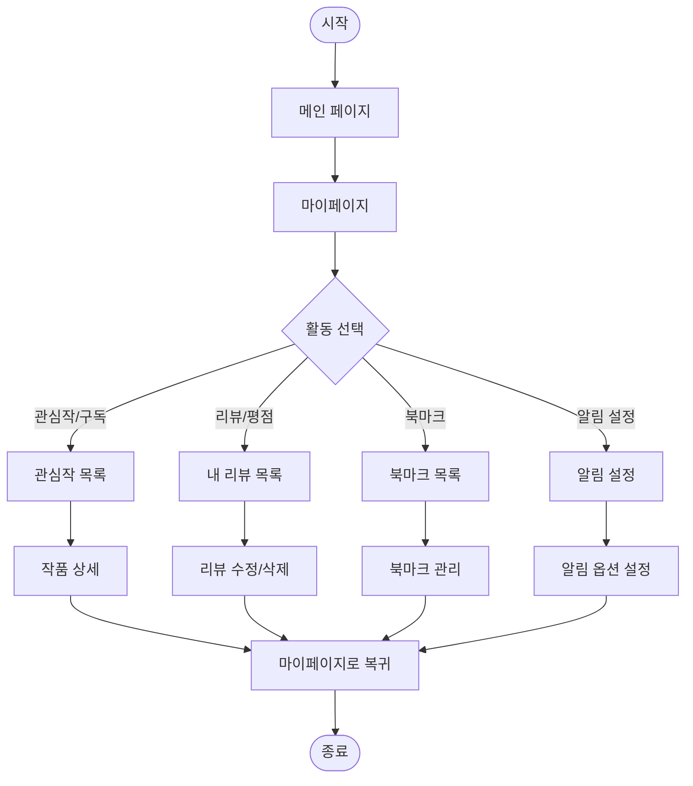
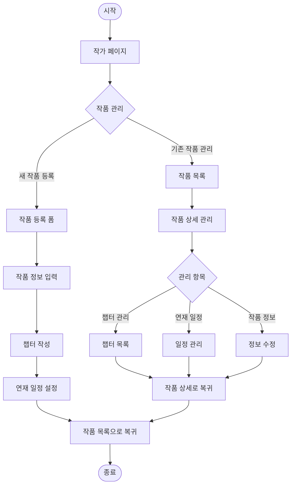
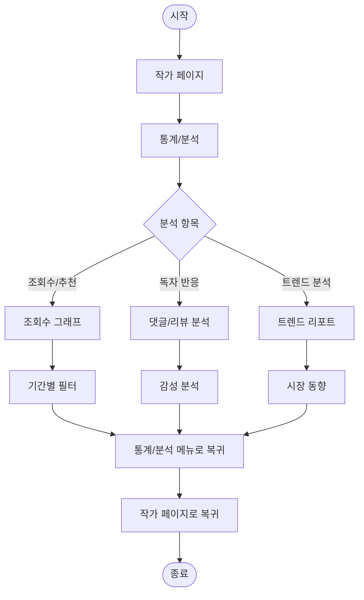
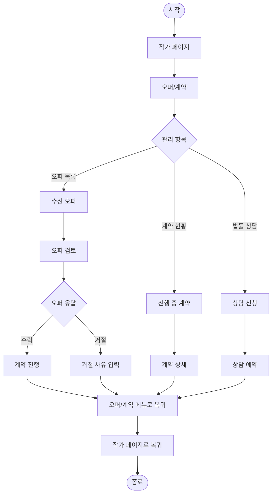

# 사용자 플로우 다이어그램 (User Flow Diagrams)

## 1. 개요

소설 플랫폼 통합 중계 서비스의 주요 사용자 시나리오에 대한 상세 플로우를 정의합니다. 각 사용자(독자/작가)가 서비스를 통해 목표를 달성하는 과정을 단계별로 표현합니다.

## 2. 독자 플로우

### 2.1 작품 탐색 및 읽기 플로우

### 2.2 커뮤니티 참여 플로우

### 2.3 마이페이지 활동 플로우

## 3. 작가 플로우

### 3.1 작품 관리 플로우

### 3.2 통계/분석 플로우

### 3.3 오퍼/계약 관리 플로우

## 4. 예외 처리 및 분기

### 4.1 로그인/인증 관련

- 비로그인 사용자
  - 작품 읽기: 무료 작품만 가능
  - 리뷰/평점: 로그인 요청
  - 북마크: 로그인 요청
  - 커뮤니티: 읽기만 가능

- 작가 인증
  - 작품 등록: 작가 인증 필요
  - 통계 확인: 작가 인증 필요
  - 오퍼 관리: 작가 인증 필요

### 4.2 콘텐츠 접근 제한

- 연령 등급
  - 미성년자: 15세 이상 콘텐츠 제한
  - 성인 콘텐츠: 본인인증 필요

- 유료 콘텐츠
  - 무료 회원: 미리보기만 가능
  - 유료 회원: 전체 접근 가능

### 4.3 오류 처리

- 검색 결과 없음
  - 추천 작품 표시
  - 검색어 수정 제안

- 서비스 연결 실패
  - 재시도 안내
  - 대체 경로 제시

- 데이터 로딩 실패
  - 재시도 버튼
  - 오류 메시지 표시 