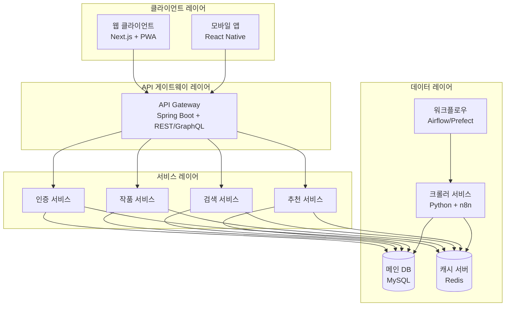

# 시스템 아키텍처 다이어그램

## 1. 개요

본 문서는 "소설 플랫폼 통합 중계 서비스"의 시스템 아키텍처를 정의합니다. 서비스의 주요 컴포넌트와 이들 간의 상호작용을 시각화하여 기술적 구조를 명확히 합니다.

## 2. 시스템 아키텍처

### 2.1 전체 시스템 구성도

### 2.2 주요 컴포넌트 설명

#### 2.2.1 클라이언트 레이어
- **웹 클라이언트**
  - Next.js 기반 PWA
  - SSR 지원으로 SEO 최적화
  - 반응형 디자인 적용
  - TypeScript + Tailwind CSS

- **모바일 앱**
  - React Native 기반 크로스 플랫폼
  - 네이티브 성능 최적화
  - 오프라인 지원
  - 푸시 알림 기능

#### 2.2.2 API 게이트웨이 레이어
- **API Gateway**
  - Spring Boot 기반 API 서버
  - REST API (주력)
    - 작품 검색, 필터링, 정렬
    - 사용자 인증/인가
    - 작품 상세 정보 조회
  - GraphQL API (선택적)
    - 복잡한 데이터 조회
    - 실시간 업데이트
    - 클라이언트 요구사항에 따른 유연한 데이터 제공
  - 요청 라우팅 및 로드 밸런싱
  - API 버전 관리

#### 2.2.3 서비스 레이어
- **인증 서비스**
  - JWT 기반 인증
  - 소셜 로그인 통합
  - 권한 관리
  - 서비스 간 통신: REST API

- **작품 서비스**
  - 작품 정보 관리
  - 플랫폼별 데이터 동기화
  - 가격 및 구독 정보 관리
  - 서비스 간 통신: REST API

- **검색 서비스**
  - 실시간 검색
  - 필터링 및 정렬
  - 검색어 추천
  - 서비스 간 통신: REST API

- **추천 서비스**
  - 개인화된 추천
  - 인기 작품 추천
  - 유사 작품 추천
  - 서비스 간 통신: REST API

#### 2.2.4 데이터 레이어
- **메인 DB (MySQL)**
  - 사용자 정보
  - 작품 메타데이터
  - 거래 내역
  - 마스터 데이터 관리

- **캐시 서버 (Redis)**
  - 세션 관리
  - API 응답 캐싱
  - 실시간 데이터
  - 인메모리 데이터 처리

- **크롤러 서비스**
  - Python (BeautifulSoup, Selenium)
  - n8n 워크플로우 자동화
  - 플랫폼별 데이터 수집
  - 배치 작업 스케줄링
  - 에러 처리 및 재시도
  - 데이터 검증 및 정제

- **워크플로우 관리**
  - Airflow/Prefect
  - 데이터 파이프라인 자동화
  - 스케줄링 및 모니터링
  - 크롤링 작업 관리
  - 데이터 동기화 관리

### 2.3 데이터 흐름

#### 2.3.1 작품 검색 흐름
1. 클라이언트 검색 요청
2. API Gateway 라우팅
3. 검색 서비스 처리
4. MySQL/Redis 조회
5. 결과 반환 및 캐싱

#### 2.3.2 작품 등록 흐름
1. 작가의 등록 요청
2. API Gateway 인증
3. 작품 서비스 처리
4. DB 저장
5. 캐시 업데이트

#### 2.3.3 크롤링 데이터 흐름
1. 스케줄러에 의한 크롤링 작업 트리거
2. 크롤러 서비스 실행
3. 플랫폼별 데이터 수집
4. 데이터 검증 및 정제
5. DB 저장 및 캐시 업데이트
6. 워크플로우 상태 업데이트

### 2.4 확장성 고려사항

#### 2.4.1 수평적 확장
- 서비스별 독립적 스케일링
  - Docker 컨테이너화
  - Kubernetes 오케스트레이션
  - 서비스별 독립 배포
- 로드 밸런서를 통한 트래픽 분산
- 데이터베이스 샤딩 전략

#### 2.4.2 고가용성
- AWS/GCP 다중 리전 배포
- 장애 복구 전략
  - 서비스 자동 복구
  - 데이터 백업 및 복구
  - 장애 감지 및 알림
- 무중단 배포 전략

#### 2.4.3 성능 최적화
- CDN 활용
  - 정적 자원 캐싱
  - 글로벌 엣지 서버
- Redis 캐시 전략
  - 자주 조회되는 데이터 캐싱
  - 세션 데이터 관리
- 비동기 처리
  - 메시지 큐 활용
  - 배치 작업 처리

## 3. 기술 스택

### 3.1 프론트엔드
- Next.js (PWA 지원)
- React Native
- TypeScript
- Tailwind CSS

### 3.2 백엔드
- Java (Spring Boot)
- REST/GraphQL API
- JWT 인증

### 3.3 데이터베이스
- MySQL
- Redis

### 3.4 크롤링/수집
- Python (BeautifulSoup, Selenium)
- n8n (워크플로우 자동화)
- Airflow/Prefect

### 3.5 인프라
- Docker
- AWS/GCP
- GitHub Actions (CI/CD)

## 4. 보안 고려사항

### 4.1 인증/인가
- JWT 기반 인증
- OAuth 2.0
- RBAC (역할 기반 접근 제어)

### 4.2 데이터 보안
- 데이터 암호화
  - 전송 데이터 암호화 (HTTPS)
  - 저장 데이터 암호화
- API 키 관리
- 접근 제어

### 4.3 모니터링
- 로깅 시스템
  - 중앙화된 로그 관리
  - 로그 분석 및 알림
- 성능 모니터링
  - 서비스 상태 모니터링
  - 리소스 사용량 모니터링
- 보안 모니터링
  - 침입 탐지
  - 이상 징후 감지
