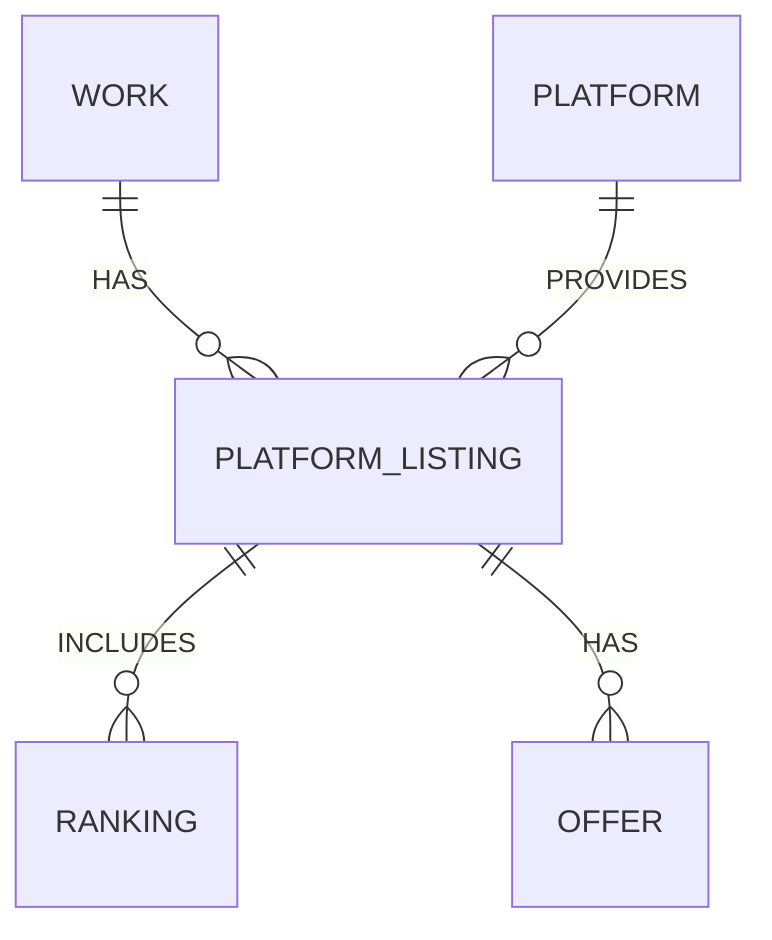

# 국내 소설 플랫폼 통합 중계 서비스

---

## 1. 프로젝트 개요 및 목표

- **주요 목적:** 국내 소설 플랫폼(카카오페이지, 네이버시리즈, 리디북스, 문피아, 조아라 등)의 인기/신작/완결작 등 작품 순위를 통합 중계 _(초기에는 국내 플랫폼에 집중, 향후 해외 플랫폼 확장 목표)_
- **부가 목적:** 누구나 무료로 연재할 수 있는 자체 창작 공간 제공 및 타 소설 플랫폼 유료 데뷔 연계(신인 작가 발굴/추천)
- 각 작품 클릭 시 원본 플랫폼으로 이동(딥링크)
- 플랫폼별/장르별/기간별 랭킹, 트렌드, 신작 등 통합 제공
- 저작권/법적 리스크 최소화, 플랫폼과의 상생 구조 지향
- **작가는 웹(에디터/관리), 독자는 앱(감상/알림/커뮤니티) 투트랙 전략**
- **순위 데이터의 표현 방식(플랫폼별/장르별/기간별/집계기준/비주얼/상세/딥링크 등)을 명확히 정의**

---

## 2. 주요 서비스/기능

| 역할 구분 | 기능                      | 설명                                                                                                                              |
| --------- | ------------------------- | --------------------------------------------------------------------------------------------------------------------------------- |
| **주**    | 순위 중계                 | 플랫폼별/장르별/기간별 인기/신작/완결 랭킹, 집계 기준 명확 표기, 리스트/카드/그래프 등 다양한 뷰 제공, 각 작품별 상세/딥링크 지원 |
| **주**    | 작품 상세 정보            | 표지, 줄거리, 작가, 장르, 연재 현황, 플랫폼별 가격/이벤트 등(가능한 범위 내)                                                      |
| **주**    | 딥링크                    | 각 작품 클릭 시 해당 플랫폼 상세 페이지로 이동                                                                                    |
| **주**    | 검색/필터                 | 장르, 플랫폼, 연재/완결, 무료/유료, 기간 등 다양한 조건으로 검색/필터                                                             |
| **주**    | 트렌드 분석               | 플랫폼별/장르별 인기 변화, 신작 트렌드 등 데이터 시각화                                                                           |
| **주**    | 유저 맞춤형               | 개인화 추천, 관심작/작가 구독, 알림, 유저 리뷰/평점(확장 가능)                                                                    |
| **부**    | **무료 연재 공간**        | 누구나 직접 소설 연재(무료), 자체 플랫폼 내 중계/랭킹/추천/커뮤니티, 타 플랫폼 유료 데뷔 연계 지원                                |
| **부**    | **작가 오퍼/입찰 시스템** | 여러 플랫폼이 연재작에 오퍼(계약조건) 제안, 작가는 조건 비교 후 초이스, 투명한 데뷔/계약 경로 제공                                |
| **부**    | **작가용 웹 에디터/관리** | 데스크탑/태블릿 최적화, 마크다운/리치텍스트, 챕터/통계/오퍼 관리, 운영툴 등                                                       |
| **부**    | **독자용 모바일 앱 뷰어** | 가독성 최적화(폰트, 다크모드, 이어보기), 푸시알림, 북마크, 커뮤니티, 앱스토어 배포                                                |

---

### 순위 데이터 표현 방식

- **플랫폼별**: 네이버/카카오/문피아/조아라 등 각 플랫폼별 인기/신작/완결 랭킹 탭/필터
- **장르별**: 판타지/무협/SF/로맨스 등 장르별 인기/신작/완결 랭킹
- **기간별**: 일간/주간/월간/누적 랭킹, 기간 선택 필터
- **집계 기준**: 조회수/구매/리뷰/별점 등 플랫폼별 집계 기준 명시, 자체 메타 랭킹(가중치 합산)도 가능
- **비주얼**: 리스트/카드/표/그래프(트렌드 변화), 표지+간략 정보+랭킹 변화 아이콘 등
- **상세**: 작품 클릭 시 상세 정보(플랫폼별 순위, 트렌드 그래프, 리뷰 등)
- **딥링크**: 각 작품별 "원본 플랫폼 바로가기" 버튼/링크

---

## 3. 기술 아키텍처/스택

- **백엔드**: Java (Spring Boot)
- **프론트엔드(웹)**: Next.js (PWA 지원)
- **모바일 앱**: React Native, Flutter, Swift/Kotlin (iOS/Android)
- **DB**: MySQL (관계형), Redis (캐싱)
- **API**: REST/GraphQL, JWT 인증 (웹/앱 공통 백엔드)
- **크롤링/수집**: Python (BeautifulSoup, Selenium), Puppeteer, n8n(워크플로우 자동화), Airflow, Prefect 등
- **배포/운영**: Docker, AWS/GCP, GitHub Actions(CI/CD)
- **실시간 동기화**: 웹-앱 데이터/알림 실시간 연동

---

## 4. 데이터 수집/동기화 전략

- 공식 API 제공 플랫폼: API 활용
- 미제공 플랫폼: 크롤링(robots.txt, 이용약관 준수), 데이터 파싱 자동화
- n8n 등 워크플로우 자동화 툴을 활용해 크롤링/수집/DB적재/알림 등 파이프라인 구성
- 크롤링 주기: 인기/신작은 1~3시간, 전체 데이터는 1일 1회 등 차등 적용
- 에러/차단 대응: User-Agent, Proxy, 백오프(backoff) 전략 적용
- **크롤러 장애/실패시 자동 재시도 및 관리자 알림(Slack, Email 등) 적용**
- **수집 데이터 검증 로직 및 관리자용 데이터 정정/보완 웹툴 제공**

---

## 5. 데이터베이스 구조

상세한 최신 데이터베이스 스키마는 별도의 '데이터베이스 스키마' 문서를 참조해주십시오. 해당 문서에는 다음과 같은 최신 구조가 포함되어 있습니다:
- 작가 정보 분리 (authors 테이블)
- 플랫폼별 작품 연재 정보 (platform_listings 테이블)
- 자체 연재 작품 관리 (free_novels 테이블)
- 기타 확장된 테이블 구조 및 관계

---

## 6. 운영/확장 전략

- 플랫폼/장르 추가 시 DB 구조 및 크롤러 모듈화
- 크롤러/수집기 별도 서비스화(Microservice 구조 고려)
- 팀 협업 대비: 코드/데이터/운영 문서화, API 명세 자동화(OpenAPI)
- 장애/에러 모니터링: Sentry, Slack 알림 등
- **API 인증/인가(JWT, OAuth 등) 적용, 개인정보/보안 정책 수립**
- **관리자 웹툴(데이터 정정, 수집 현황 모니터링, 자체 연재작 신고/관리, 오퍼/계약 관리 등) 제공**
- **웹-앱 데이터/알림 실시간 동기화, 앱스토어 정책 대응, PWA 한계 및 앱 개발 단계적 확장**

---

## 7. 리스크 및 대응 방안

| 리스크                          | 대응 방안                                                |
| ------------------------------- | -------------------------------------------------------- |
| 크롤링 차단/법적 이슈           | robots.txt, 약관 준수, 플랫폼 제휴/협의, 데이터 최소화   |
| 데이터 동기화 오류              | 주기적 검증, 에러 로깅, 수동 동기화 툴 제공              |
| 랭킹 기준 불명확                | 각 플랫폼 기준 명확히 표기, 자체 메타 랭킹 알고리즘 개발 |
| 트래픽/성능 이슈                | 캐싱, 비동기 처리, 서버 확장성 확보                      |
| 개인정보/보안                   | 인증/인가, 데이터 암호화, 접근제어, 보안 정책 수립       |
| 불법/유해/저작권 침해물 업로드  | 신고/필터링/관리자 검수, 운영정책/이용약관 명확화        |
| 운영 리소스 증가                | 커뮤니티/콘텐츠 관리 자동화 및 운영툴 강화               |
| 작가/플랫폼 간 계약/저작권 이슈 | 데뷔 연계시 계약/저작권 정책 명확화, 플랫폼 협의         |
| 허위/낮은 오퍼 남발             | 플랫폼 신뢰도/평판 시스템, 최소 조건 제한 등             |
| 계약/저작권 분쟁                | 오퍼/계약서 표준화, 법률 자문, 분쟁 조정 프로세스        |
| 개인정보 보호                   | 오퍼/계약 정보 접근권한, 보안 정책 강화                  |

---

## 8. 향후 발전 방향

- 메타 랭킹(플랫폼별 인기 지표 가중 평균)
- AI 기반 추천/큐레이션, 개인화 알림/구독
- 오픈 API 제공(외부 개발자/협력사 대상)
- 글로벌/다국어 지원(해외 플랫폼 연동, 영문 UI 등)
- 커뮤니티(팬아트, 팬픽션, 토론방, 작가 인터뷰 등)
- 데이터 시각화/리포트 제공(장르별/플랫폼별 트렌드, 작가/출판사 대상 유료 리포트)
- 관리자/운영자 도구(데이터 정정, 장애 모니터링, 통계 등)
- **무료 연재→타 플랫폼 유료 데뷔 연계(신인 작가 발굴/추천, 작가-플랫폼 연결 채널)**
- **자체 연재작 큐레이션/랭킹/추천, 작가 프로필/연재 통계/알림 등 고도화**
- **오퍼/계약 자동화, 표준계약서, 법률상담 연계**
- **플랫폼별 오퍼 통계/트렌드 시각화, 작가 후기/평판 시스템**
- **글로벌 오퍼 연동(해외 플랫폼 입찰/계약 지원)**

---

## 9. 전문가 관점 진단 및 개선 포인트

- **README.md 구조**: 실무/협업/확장성 관점에서 충분히 체계적이나, 아래 항목 추가 시 완성도 향상
  - [x] **API 명세(샘플)**: REST/GraphQL 엔드포인트, 파라미터, 응답 예시 등 (별도 'API 명세서' 문서로 상세화 완료)
  - [x] **UI/UX 샘플**: 주요 화면(순위/상세/연재/오퍼 등) 와이어프레임, 사용자 플로우 (별도 '와이어프레임 상세 지침서'로 완성)
  - [x] **운영/관리자 도구**: 데이터 정정, 장애 모니터링, 오퍼/계약 관리 등 실제 운영 시나리오 (별도 '시스템 아키텍처 다이어그램'에 포함)
  - [x] **테스트/배포 전략**: E2E 테스트, CI/CD, 롤백/모니터링 등 실무 적용 방안 (별도 '프로젝트 계획서'에 상세화)
  - [x] **보안/개인정보**: JWT/OAuth, 데이터 암호화, 접근제어, 로그 관리 등 (별도 '시스템 아키텍처 다이어그램'에 포함)
  - [x] **문서화/코드 품질**: OpenAPI, ERD, 코드 컨벤션, 주석/README 일관성 (각 상세 문서에서 체계적으로 관리)

---

## 10. 실무 팁 및 참고 자료

### 1) Mermaid ERD 문법 실무 팁

- 한글/괄호/주석 사용 시 파싱 오류 발생 → **영문, 주석 제거, 단순화 권장**
- 관계(1:N, N:M) 명확히, PK/FK 표기 일관성 유지
- ERD는 DB 설계와 100% 일치 필요 없음(개념/관계 위주)
- ERD/DB 구조 변경 시, 마이그레이션/버전 관리 필수

### 2) API 명세(REST 예시)

```http
GET /api/v1/novels?platform=naver&genre=fantasy&rankType=popular

Response:
{
  "novels": [
    {
      "id": "nvl_123",
      "title": "소설 제목",
      "author": "작가명",
      "coverUrl": "...",
      "platform": "네이버시리즈",
      "rank": 1,
      "rankType": "popular",
      "detailUrl": "..."
    }, ...
  ]
}
```

### 3) UI/UX 샘플(순위/상세/연재/오퍼)

- [ ] **순위 메인**: 플랫폼/장르/기간별 탭, 카드/리스트/그래프 뷰, 표지+랭킹 변화 아이콘
- [ ] **작품 상세**: 표지, 줄거리, 작가, 플랫폼별 순위/이벤트, 딥링크, 트렌드 그래프
- [ ] **무료 연재**: 웹 에디터(마크다운/리치텍스트), 챕터 관리, 오퍼/통계
- [ ] **오퍼/입찰**: 플랫폼별 오퍼 리스트, 조건 비교, 계약 진행 플로우
- [ ] **앱 뷰어**: 가독성(폰트/다크모드), 이어보기, 북마크, 커뮤니티, 푸시알림

### 4) 참고 자료/링크

- [Mermaid ERD 공식 문서](https://mermaid-js.github.io/mermaid/#/entityRelationshipDiagram)
- [OpenAPI/Swagger](https://swagger.io/)
- [n8n 워크플로우 자동화](https://n8n.io/)
- [Spring Boot 공식](https://spring.io/projects/spring-boot)
- [Next.js 공식](https://nextjs.org/)
- [React Native 공식](https://reactnative.dev/)
- [Flutter 공식](https://flutter.dev/)

---

## 11. 현실적 한계 및 실무적 대응 전략

| 이슈/리스크          | 상세 내용                                      | 실무적 대응 방안                                                                                          |
| -------------------- | ---------------------------------------------- | --------------------------------------------------------------------------------------------------------- |
| **데이터 수집**      | 플랫폼 크롤링 차단, 구조 변경, API 미제공      | ① 협조적/용이한 플랫폼 우선, ② 크롤러 모듈화/자동화, ③ 장애 감지/알림, ④ API 제휴 적극 추진               |
| **법적/저작권**      | 표지/줄거리 등 저작권, 공정경쟁법, 데이터 복제 | ① 법률 자문, ② 저작권 침해 소지 적은 정보(작품명/작가/딥링크/순위) 위주로 시작, ③ 서비스 범위 점진적 확장 |
| **플랫폼/작가 유치** | 대형 플랫폼/작가 유입 난이도, 커뮤니티 관리    | ① "유료 데뷔 연계" 등 차별화 유인책, ② 플랫폼 제휴/상생 구조 어필, ③ 운영 자동화/필터링 강화              |
| **오퍼/입찰 시스템** | 플랫폼 참여 유인, 허위 오퍼, 신뢰성            | ① 플랫폼 인증/평판 시스템, ② 오퍼 조건 표준화, ③ 계약/분쟁 표준 프로세스                                  |
| **기술스택 선택**    | 모바일/크롤링/배포 등 도구 다양성              | ① 초기엔 React Native/Flutter 등 단일 크로스플랫폼 집중, ② Python+n8n 조합으로 PoC, ③ 필요시 확장         |
| **DB 구조**          | NOVEL-PLATFORM 1:1 한계(동시 연재 등)          | ① WORK(작품)와 PLATFORM_LISTING(플랫폼별 연재) 분리, ② ERD 개선(아래 참고)                                |

### [DB 구조 개선 방향]

- 기존 NOVEL(platform_id, detail_url) → WORK(작품) + PLATFORM_LISTING(work_id, platform_id, detail_url, status 등) 분리
- RANKING, OFFER 등은 PLATFORM_LISTING과 연결
- ERD 예시(개념):


- ... 기타 엔티티 연결 ...
---

## 12. 단계별 MVP 및 실행 전략

1. **1단계(코어 독자 기능)**
   - 소수 국내 주요 플랫폼(2~3개) 대상, 저작권 이슈 적은 랭킹 정보(작품명/작가/딥링크/순위)만 통합 제공
   - 딥링크 트래픽 제공으로 플랫폼에 기여하는 구조 우선 테스트
2. **2단계(코어 작가 기능 - 파일럿)**
   - 자체 무료 연재 공간, 기본 웹 에디터, 소수 작가 유치 및 피드백
   - "유료 데뷔 연계"는 우수작 추천→플랫폼 담당자 전달 방식 등 현실적 접근
3. **PoC/기술 검증**
   - 주요 타겟 플랫폼 크롤링/수집 PoC, 기술적/법적 리스크 사전 파악
   - _모바일 앱/크롤링/배포 등 기술스택 최종 결정은 실제 개발 용이성, 성능, 커뮤니티 지원 등을 기준으로 확정_
4. **법률 자문**
   - 서비스 범위/데이터 활용 법적 검토, 리스크 최소화
5. **점진적 확장**
   - 시장 반응/운영 노하우 축적 후 오퍼 시스템, 커뮤니티, 대상 플랫폼 확대(해외 플랫폼 연동은 확장 단계에서 추진)

---

## 14. Minor Considerations(세부 조정/보완점)

- **기술스택 최종 결정:**
  - 모바일 앱(React Native, Flutter, Swift/Kotlin) 및 크롤링/수집 도구(Python, n8n, Airflow 등)는 MVP 1단계 또는 PoC 단계에서 실제 개발 용이성, 성능, 커뮤니티 지원 등을 기준으로 최종 확정
- **오퍼/입찰 시스템 점진적 도입:**
  - "점진적 확장" 단계에서 파일럿 테스트(특정 장르/소수 플랫폼 비공개 테스트, 작가 오퍼 요청 기능 등)로 현실적 진입 전략 제시
- **국내외 플랫폼 범위 명확화:**
  - 초기 목표는 국내 플랫폼 집중, 향후 발전 방향/확장 단계에서 해외 플랫폼 연동 추진
- **문서화/실행 전략:**
  - 각 단계별 결과와 시장 반응에 따라 계획을 유연하게 조정, 핵심 기능부터 검증 후 점진적 확장

---

## 13. 수익모델/운영모델 방향성

| 수익모델 유형               | 구체적 예시 및 실현 방식                                                                              |
| --------------------------- | ----------------------------------------------------------------------------------------------------- |
| **플랫폼/오퍼 중개 수수료** | 딥링크/트래픽 유입 기반 제휴, 유료 데뷔 연계, 작가-플랫폼 오퍼/입찰 성사 시 계약/중개 수수료          |
| **프리미엄 서비스/구독**    | 작가(통계, 노출, 홍보 등), 독자(광고 제거, 맞춤 추천, 알림 등) 대상 구독/유료 기능, 독자→작가 후원 등 |
| **광고**                    | 웹/앱 내 배너, 네이티브 광고, 타겟팅 광고 등                                                          |
| **데이터/리포트/API 판매**  | 플랫폼/출판사/에이전시/외부 파트너 대상 트렌드/랭킹/작가 통계 리포트 및 데이터 API 유료 제공          |
| **B2B API**                 | 외부 파트너/플랫폼/에이전시 대상 데이터 API 유료 제공                                                 |
| **후원/구독**               | 독자→작가 후원, 자체 연재작 구독 등                                                                   |

**단계별 전략**

- 1단계: 트래픽/작가 유치, 플랫폼 신뢰도 확보에 집중(수익화 최소화)
- 2단계: 플랫폼/오퍼 중개 등 실질적 거래 발생 시 수수료 도입
- 3단계: 프리미엄, 광고, 데이터 리포트/API 등 점진적 확장

**실무 팁**

- 수익델은 시장 반응/제휴 성과에 따라 유연하게 조정
- 법적/세무적 이슈(계약, 세금, 정산 등) 사전 검토 필수

---

## 15. 법적 안전장치 및 제휴 전략

### 1) 플랫폼 제휴 전략
- **공식 API 협의**: 각 플랫폼과 공식 API 사용 협의 추진
- **트래픽 기여**: 딥링크를 통한 트래픽 제공으로 상생 구조 구축
- **데이터 수집 범위**: 최소 필수 정보만 수집 (작품명, 작가명, 순위, 딥링크)
- **이용약관 준수**: 각 플랫폼의 robots.txt, 이용약관 철저히 준수

### 2) 법적 검토 및 대응
- **법률 자문단**: 저작권/정보통신법 전문 변호사 섭외
- **이용약관**: 서비스 이용약관, 개인정보처리방침 철저히 수립
- **저작권 정책**: 표지/줄거리 등 저작권 침해 소지 있는 정보 제한
- **분쟁 해결**: 분쟁 조정 프로세스 및 법적 대응 매뉴얼 수립

### 3) 데이터 보안
- **암호화**: 개인정보/중요 데이터 암호화 저장
- **접근제어**: 역할별 접근 권한 체계화
- **감사**: 데이터 접근/수정 이력 관리
- **백업**: 정기적 데이터 백업 및 복구 체계

## 16. 초기 사용자 유치 전략

### 1) 작가 유치 전략
- **무료 연재 혜택**: 초기 작가 특별 혜택 (노출, 홍보, 통계 등)
- **작가 지원 프로그램**: 신인 작가 발굴/육성 프로그램 운영
- **커뮤니티**: 작가 간 네트워킹/멘토링 시스템 구축
- **수익화 지원**: 다양한 수익화 채널 연계 지원

### 2) 독자 유치 전략
- **초기 혜택**: 가입 시 프리미엄 기능 무료 체험
- **추천 시스템**: AI 기반 맞춤형 작품 추천
- **커뮤니티**: 독자 리뷰/평점, 토론방 운영
- **이벤트**: 정기적인 이벤트/프로모션 진행

### 3) 마케팅 전략
- **SNS 마케팅**: 인스타그램, 트위터 등 SNS 채널 활용
- **인플루언서**: 작가/독자 인플루언서 협업
- **콘텐츠 마케팅**: 블로그, 유튜브 등 콘텐츠 채널 구축
- **검색 최적화**: SEO/SEM 전략 수립

## 17. 통합 운영 및 차별화 전략

### 1) AI 기반 서비스
- **개인화 추천**:
  - 사용자 취향 분석 기반 작품 추천
  - 장르/플랫폼별 인기 트렌드 예측
  - 작품 분석/피드백 AI 도구
  - 유해 콘텐츠 AI 필터링

### 2) 커뮤니티 특화
- **팬아트/팬픽션**:
  - 작품 기반 창작물 공유
  - 정기적인 작가 인터뷰/라이브
  - 작품별 토론방/독서모임
  - 온/오프라인 이벤트

### 3) 작가 지원 프로그램
- **포트폴리오/마케팅**:
  - 전문 프로필, 작품 포트폴리오
  - SNS 홍보, 커뮤니티 노출
  - 독자 이벤트, 피드백 시스템

- **데뷔/계약 지원**:
  - 우수작품 담당자 추천
  - 플랫폼 오픈콜 연계
  - 계약 상담, 법률 자문
  - 수익화 전략 수립

- **성장 지원**:
  - 워크샵, 멘토링, 피드백
  - 작가 네트워킹
  - 협업 기회 제공

### 4) 작가 지원 프로그램 단계별 실행 계획

- **1단계 (1-3개월)**:
  - 핵심 작가 그룹(10-20명) 대상 심층 인터뷰
  - 기본 가이드라인 및 체크리스트
  - 기본 수익 모델 가이드라인
  - 성공 사례 분석 리포트

- **2단계 (4-6개월)**:
  - 자동화된 월간 설문 시스템
  - 웨비나 교육 프로그램
  - 플랫폼별 수익 구조 분석
  - 마케팅 전략 가이드

- **3단계 (7-12개월)**:
  - AI 기반 피드백 분석
  - 제휴 전문가 상담 연결
  - AI 기반 최적 모델 추천
  - 맞춤형 마케팅 전략

> 참고: 서비스 핵심 기능의 MVP 단계별 계획은 별도의 '프로젝트 계획서' 문서를 참조하십시오.

---
